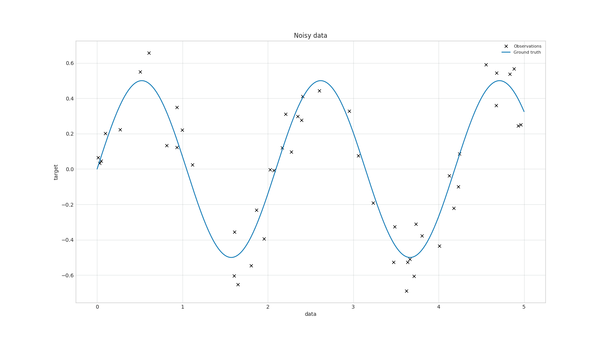
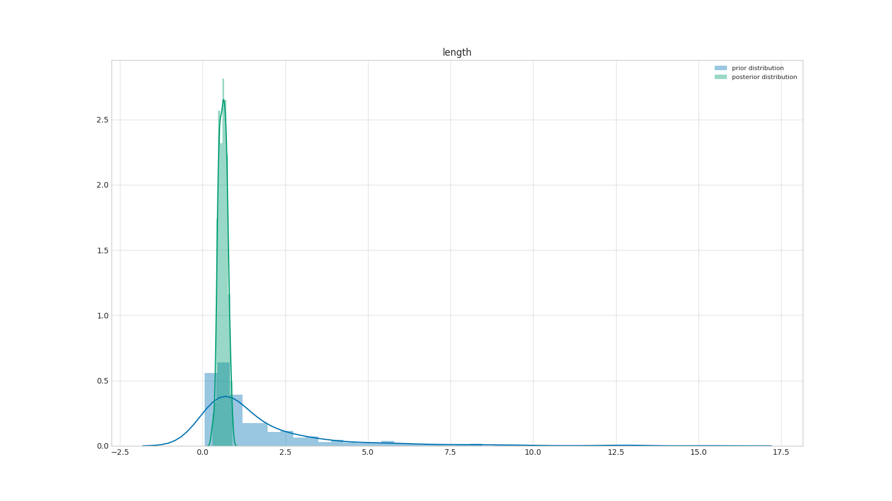
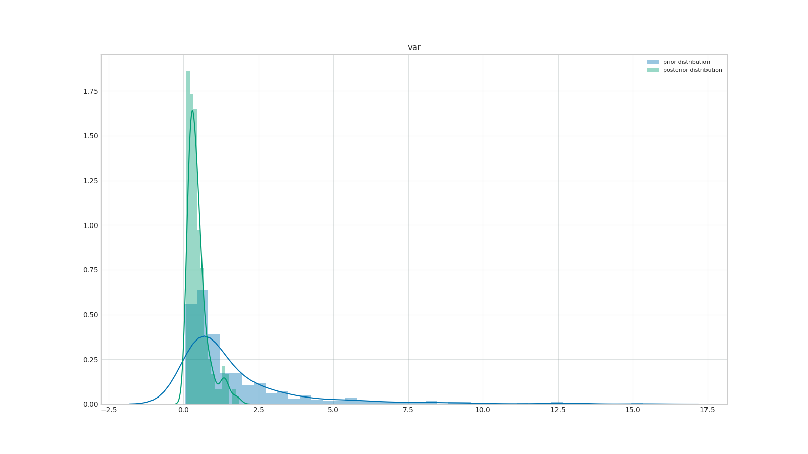
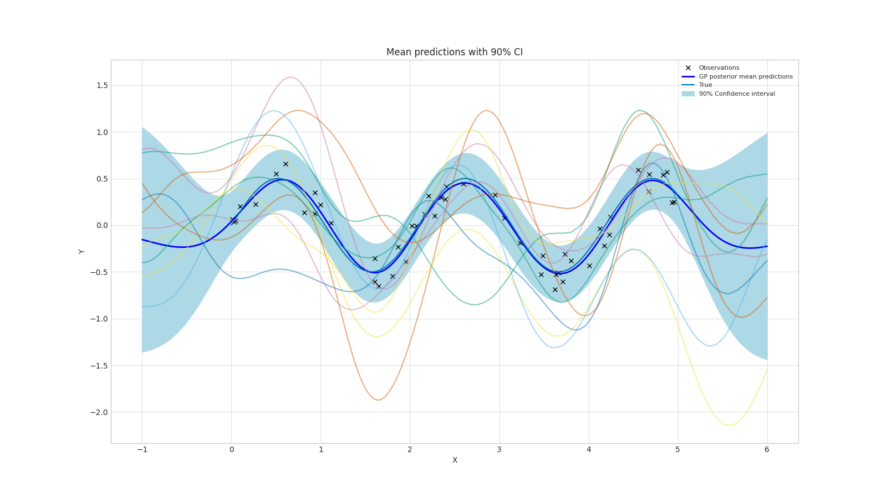

# ML-Gaussian-Process

Gaussian Process Regression from scratch.

Blog post: https://imadelhanafi.com/posts/gaussian_process_ml/

# Requirements
To run the Gaussian process regression, two options are provided: Conda or Docker.

## Docker (recommended)
Docker allows us to create a reproducible environment and avoid any system-related issues.

- Build docker image

```bash
docker build -t gpr .
```

- Mount the current directory and run a Bash session inside the container

```bash
docker run -i -t --rm -v $(pwd):/app gpr bash
```


## Conda environment 

- Create a python environment

```bash
conda env create --file=environment.yml
```

- Activate the conda environment in your terminal

```bash
cd tesla_challenge
conda activate data-analysis
```

# Examples - Results

## Repo structure

- `data/`: Folder containing data used for the Gaussian regression example.
- `gpr/`: Code for GP regression qnd kernels
    - `gp_regression.py`: Module for GP regression.
    - `kernels.py`: Kernel definition used by Gaussian Processes.
    - `utils.py`: Logger function.
    - `generate_data.py`: Simulate noisy sinusoidal data.
- `inference/`: Generic inference modules (MCMC and SVI). 
- `results/`: Results and logs of the Gaussian Process Regression on simulated data and Snelson data.


## Example

Two examples of GP regression are provided:

- `example_mcmc_data.py`: Example on real data (Snelson dataset).
- `example_mcmc_synthetic.py`: Example on synthetic data (Sinusoidal data).
  
To run the example, get inside the Docker container or the Conda environment and run

```bash
python example_mcmc_synthetic.py
```

The outputs and logs are saved in `results/mcmc/`.

```
root@5e6c03a73071:/app# python example_mcmc_synthetic.py 
10/03 08:55:46 AM | Generate simulated data
10/03 08:55:48 AM | Plot generated data
INFO:GP:Plot generated data
10/03 08:55:48 AM | Plot prior functions with RBF(1,1)
INFO:GP:Plot prior functions with RBF(1,1)
10/03 08:55:50 AM | Running MCMC
INFO:GP:Running MCMC
sample: 100%|████████████████████████████████████████████████████████████████████████████████| 400/400 [00:11<00:00, 34.06it/s, 3 steps of size 5.81e-01. acc. prob=0.92]
MCMC time: 16.302778720855713
                mean       std    median      5.0%     95.0%     n_eff     r_hat
    length      0.61      0.12      0.61      0.42      0.80    119.26      1.01
     noise      0.02      0.00      0.02      0.01      0.03    169.63      1.00
       var      0.47      0.35      0.38      0.10      0.94     85.40      1.03

Number of divergences: 0
None
10/03 08:56:06 AM | MCMC complete
INFO:GP:MCMC complete
10/03 08:56:09 AM | Posterior predictions on the interval of simulated data
INFO:GP:Posterior predictions on the interval of simulated data
```

The `example_mcmc_synthetic.py` consists of the following steps:

### Define the GP regression configuration
The configuration of the Gaussian Process regression is defined as a dictionary. For simulated data, we can select the number of observation for the training dataset and the noise level (see gpr/generate_data.py)
It define the GP regression kernel as well as the prior distribution on the the trainable parameter. 

```python
configuration = {
    'exp_name': 'Simulated data',
    'data': 'simulated',
    'seed': 42,
    # in case of simulated data
    'n_obs': 50,
    'noise_level': 0.2,
    # GP parameters
    'kernel': RBFKernel,
    'priors': {
        # same names as in RBFKernel
        'length': dist.LogNormal(0.0, 1.0),
        'var': dist.LogNormal(0.0, 1.0),
        'noise': dist.LogNormal(0.0, 1.0),
    },
    # MCMC parameters
    'num_warmup':200,
    'num_samples':200,
    'num_chains':1,
}
```

### Generate/plot of the data

The noisy periodic data is generated from the function f(x) = 1/2 sin(3x) + noise



### Plot the prior functions (kernels)

For a fixed value of the Kernel's parameters, we can plot samples from the prior functions


Before observing training data, we have no prior knowledge on the relationship between y and x.


### Define the GP

To define GP regression module, we need a kernel and priors over the hyperparameters. 
(The hyperparameters can be given as floats if we want to use SVI for a point estimate)

```python
gp = GPRegression(config.kernel, config.priors, None)
```

### Run MCMC inference
Using Numpyro, we can run the MCMC inference to get samples from the posterior distribution over the hyperparameters of the Kernel. 

```python
# Random seed
rng_key = random.PRNGKey(seed)
# run inference
# Refer to mcmc_inference definition for documentation
samples = mcmc_inference(gp.likelihood, config.num_warmup, config.num_samples, config.num_chains, rng_key, noisy_data['X'],noisy_data['y'])
```

### Plot prior/posterior distribution over hyperparameters

After getting samples from the posterior, we can plot the histograms of priors/posteriors.






### Run predictions on new data points

Using the simulated posterior distribution, we can run Gaussian Process predictions over random x values and obtain a confidence level.



---

Imad El.